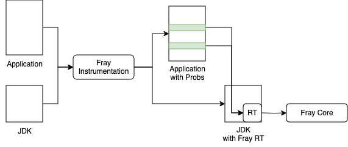

# Run Fray

- To run Fray, you first need to build the project and create a instrumented JDK.

```bash
./gradlew build
./gradlew jlink
./gradlew shadowJar
```

- Next, you can run Fray!
  - You may follow the `examples` folder to understand how to run sfuzz using gradle.
  - You can also run sfuzz through command line. We created a wrapper `bin/sfuzz` for you
    to setup environment.
    - Command: `bin/sfuzz CLASS_PATH ARGS_TO_FRAY`
    - For example, to run `bin/sfuzz` for `examples` program, you need
        - `./bin/sfuzz ./examples/build/classes/java/main example.Main -o ./examples/build/report --scheduler fifo`
    - To understand Fray args you can:
        - `./bin/sfuzz dummy --help`


# Architecture




# Runtime

Runtime should be **super** light weight. It should not include any dependencies. It should not call any JDK methods.
It is a delegate between **core** and **instrumentation**.

# Scheduling

It is operations' responsibility to decide whether an operation triggers a reschedule.

# Threads

Each thread should only try to block itself.

We should reschedule a thread **before** a non-local operation. This gives us the opportunity to
schedule operations based on the knowledge of their effects.

Fray should proactively maintain the state of each thread instead of reactively.


# Locks

Thread blocking/resuming should be managed at Thread level instead of sync information level.

We should use `wati` and `notify` to block/unblock a thread because we will instrument semaphores as well.

```java
synchronized (monitor) {
    monitor.wait();
}
synchronized (monitor) {
        monitor.notify();
}
```

`Thread.join` should be handled the same way as `Object.wait`

# Instrumentation

Instrumentation should be as simple as possible. Ideally only static method calls.

We should have different classes to instrument different types of code so that they can be disabled easily.

# Synchronization

We should **strictly** enforce sequential execution. If a new thread is created/resumed, we
should wait for them to finish bootstrap and fully stopped before proceeding.

Thread rescheduling can only be called by the current scheduled thread.


# Limitations

- We cannot remove monitors in JDK, but we can for applications.

