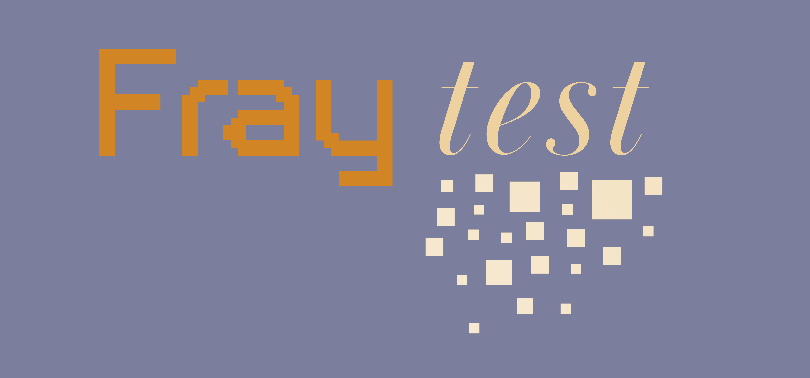

# Fray: General-Purpose Concurrency Testing 

[](https://github.com/cmu-pasta/fray/actions/workflows/build-and-test.yml)
[](https://plugins.gradle.org/plugin/org.pastalab.fray.gradle)
[](https://central.sonatype.com/artifact/org.pastalab.fray.maven/fray-plugins-maven)
[](https://plugins.jetbrains.com/plugin/26623-fray-debugger)
[](https://discord.gg/2VkNRuHUCX)


<a href="https://github.com/cmu-pasta/fray">
  
</a>


Fray is a concurrency testing tool for Java that can help you **find and debug tricky race conditions that manifest as assertion violations, run-time exceptions, or deadlocks**.
It performs controlled concurrency testing using state-of-the-art techniques such as [probabilistic concurrency testing](https://www.microsoft.com/en-us/research/wp-content/uploads/2016/02/asplos277-pct.pdf) 
or [partial order sampling](https://www.cs.columbia.edu/~junfeng/papers/pos-cav18.pdf). Fray also provides deterministic replay capabilities for debugging specific thread interleavings. Fray is designed 
to be easy to use and can be integrated into existing testing frameworks.

# Quick Start

## JUnit 5

If you are using JUnit 5, you can use the `@ConcurrencyTest` annotation to mark a test as a concurrency test. You
also need to add the `@ExtendWith(FrayTestExtension.class)` annotation to the test class.

```java
import org.pastalab.fray.junit.junit5.FrayTestExtension;
import org.pastalab.fray.junit.junit5.annotations.ConcurrencyTest;

@ExtendWith(FrayTestExtension.class)
public class SimpleTest {
    @ConcurrencyTest
    public void concurrencyTest() {
        ... // some multithreaded code
        assert(...);
    }
}

```


## Other Testing Frameworks

Fray can be used with other testing frameworks as well. You may use the `FrayInTestLauncher`

```java
import org.pastalab.fray.junit.plain.FrayInTestLauncher;

public void test() {
    FrayInTestLauncher.INSTANCE.launchFrayTest(() -> {
        ... // some multithreaded code
        assert(...);
    });
}
```

## Gradle

To use Fray with Gradle, add the following plugin to your `build.gradle` file:

```kotlin
plugins {
    id("org.pastalab.fray.gradle") version "0.6.8"
}
```

## Maven

- First please add Fray plugin to your project

```xml
<plugin>
    <groupId>org.pastalab.fray.maven</groupId>
    <artifactId>fray-plugins-maven</artifactId>
    <version>0.6.8</version>
    <executions>
        <execution>
            <id>prepare-fray</id>
            <goals>
                <goal>prepare-fray</goal>
            </goals>
        </execution>
    </executions>
</plugin>
```

- Next, please add the `fray-junit` dependency

```xml
<dependency>
    <groupId>org.pastalab.fray</groupId>
    <artifactId>fray-junit</artifactId>
    <version>0.6.8</version>
    <scope>test</scope>
</dependency>
```


# Documentation

- [Technical Report](https://arxiv.org/abs/2501.12618)
- [Usage Guide](./docs/usage.md)
- [IDE Settings](./docs/IDE.md)
- [Bugs Found by Fray and Testimonies](./docs/bugs.md)

# Contributing

Contributions to Fray are both welcomed and appreciated! Please see our [contributing guide](./docs/contributing.md) for more information on how to contribute to Fray. 

# Publications and Media

Fray's design and evaluation is described in the following research paper (please cite this if you are referencing Fray from any other work):

> Ao Li, Byeongjee Kang, Vasudev Vikram, Isabella Laybourn, Samvid Dharanikota, Shrey Tiwari, and Rohan
> Padhye. 2025. Fray: An Efficient General-Purpose Concurrency Testing Platform for the JVM. Proc. ACM
> Program. Lang. 9, OOPSLA2, Article 417 (October 2025), 28 pages. https://doi.org/10.1145/3764119

An extended version of the paper with detailed formalizations and proofs is available at: https://arxiv.org/abs/2501.12618


Talks about Fray have been given at the following venues:
- [SPLASH 2025 by Ao Li](https://youtu.be/zoE2w2hueYQ?t=20390) 
- [DC Systems Meetup by Rohan Padhye](https://www.youtube.com/watch?v=AX6Pqz8gSYY)

# Acknowledgements

This material is based upon work supported in part by the National Science Foundation and by an Amazon Research Award.
 
Any opinions, findings, and conclusions or recommendations expressed in this material are those of the author(s) 
and do not necessarily reflect the views of any sponsor.

