```mermaid
flowchart LR
    classDef frayComponent fill:#f96
    app("Concurrent Application")
    jvm("Corretto 23")
    subgraph instrumentation
        jlink("`Jlink Plugin (JDK)`"):::frayComponent
        click jlink "https://github.com/cmu-pasta/fray/tree/main/instrumentation/jdk"
        agent("`Java Agent`"):::frayComponent
        click agent "https://github.com/cmu-pasta/fray/tree/main/instrumentation/agent"
    end
    jvm --> jlink
    app --> agent
    subgraph runtime
        instrumented_app("Instrumented Application")
        instrumented_jvm("Instrumented JVM")
        fray_runtime("Fray Runtime"):::frayComponent
    end
    agent --> instrumented_app
    jlink --> instrumented_jvm
    instrumented_jvm --> fray_runtime
    instrumented_app --> fray_runtime
    fray_runtime --> fray_runtime_delegate

    scheduler --> fray_intellij_plugin
    scheduler --> fray_mcp_server
    fray_observers --> fray_intellij_plugin
    fray_observers --> fray_mcp_server
    fray_runtime_delegate --> fray_runtime_context
    fray_runtime_context --> fray_observers
    fray_runtime_context --> scheduler

subgraph plugin
    fray_intellij_plugin("Fray IntelliJ Plugin"):::frayComponent
    click fray_intellij_plugin "https://github.com/cmu-pasta/fray/tree/main/plugins/idea"
    fray_mcp_server("Fray MCP Server"):::frayComponent
    click fray_mcp_server "https://github.com/cmu-pasta/fray/tree/main/mcp"
end

subgraph core 
    fray_runtime_delegate("Runtime Delegate"):::frayComponent
    click fray_runtime_delegate "https://github.com/cmu-pasta/fray/tree/main/core/src/main/kotlin/org/pastalab/fray/core/delegates"
    fray_runtime_context("Runtime Context"):::frayComponent
    click fray_runtime_context "https://github.com/cmu-pasta/fray/blob/main/core/src/main/kotlin/org/pastalab/fray/core/RunContext.kt"
    subgraph scheduler
        pct("PCT"):::frayComponent
        click pct "https://github.com/cmu-pasta/fray/blob/main/core/src/main/kotlin/org/pastalab/fray/core/scheduler/PCTScheduler.kt"
        pos("POS"):::frayComponent
        click pos "https://github.com/cmu-pasta/fray/tree/main/core/src/main/kotlin/org/pastalab/fray/core/scheduler/POSScheduler.kt"
        random("Random"):::frayComponent
        click random "https://github.com/cmu-pasta/fray/tree/main/core/src/main/kotlin/org/pastalab/fray/core/scheduler/RandomScheduler.kt"
    end
    fray_observers("Fray Observers"):::frayComponent
    click fray_observers "https://github.com/cmu-pasta/fray/tree/main/core/src/main/kotlin/org/pastalab/fray/core/observers"
end
```

# Instrumentation


# Runtime

Fray instruments a thin runtime layer into the JVM and the application. [Runtime.java](https://github.com/cmu-pasta/fray/blob/main/runtime/src/main/java/org/pastalab/fray/runtime/Runtime.java) lists all instrumentation points Fray adds to the application and JVM. Each instrumentation point calls a method in its corresponding delegate. Initially, the delegate is a [no-op](https://github.com/cmu-pasta/fray/blob/main/runtime/src/main/java/org/pastalab/fray/runtime/Delegate.java). This allows the JVM to bootstrap without interference. Once JVM is fully initialized and ready to run the application, Fray replaces the delegates with the actual [runtime delegates](https://github.com/cmu-pasta/fray/blob/main/core/src/main/kotlin/org/pastalab/fray/core/delegates/RuntimeDelegate.kt).


# Core

## Runtime Delegates

Before executing concurrency primitives, the application will call the runtime delegates first. The runtime delegates has only one responsibility: deciding whether this concurrency primitive should be controlled by Fray or not. There are three scenarios where Fray will not control the concurrency primitive: 1) the concurrency primitive is used by system thread (e.g., GC thread, reference handler thread, etc.); 2) Fray has modeled high-level primitives (e.g., `ReentrantLock`), so the underlying low-level primitives (e.g., `Thread.Park`) should be ignored; 3) The concurrency primitive is used by Fray.

This logic is implemented in the [DelegateSynchronizer.kt](https://github.com/cmu-pasta/fray/blob/main/core/src/main/kotlin/org/pastalab/fray/core/delegates/DelegateSynchronizer.kt), and each instrumentation point will call the `DelegateSynchronizer` to check whether the concurrency primitive should be controlled by Fray or not. 

## Runtime Context

`RunContext` is the core data structure of Fray. It contains all the information about the current execution state of the application, including the current thread, concurrency primitives, and scheduling information.

### Concurrency Context

Each concurrency context implements the semantic of a concurrency primitive. For example, `ReentrantLockContext` implements the semantic of `ReentrantLock`. It stores whether the resource is hold by a thread, the number of times the resource is acquired by the thread, and threads that are waiting for the resource. The concurrency context should stricktly follow the semantic of the JDK concurrency primitives.

### Thread Context

Thread context stores the information about the current thread, including the thread ID, the current scheduling state, and the pending operation the thread is going to execute. All pending operations are defined in [operations folder](https://github.com/cmu-pasta/fray/tree/main/core/src/main/kotlin/org/pastalab/fray/core/concurrency/operations). Operations are useful information for the scheduler to make [scheduling decisions](https://github.com/cmu-pasta/fray/blob/main/core/src/main/kotlin/org/pastalab/fray/core/scheduler/POSScheduler.kt#L44). Or unblock threads when deadlock happens.

### Schedulers

```kotlin
sealed interface Scheduler {
  fun scheduleNextOperation(
      threads: List<ThreadContext>,
      allThreads: Collection<ThreadContext>
  ): ThreadContext

  fun nextIteration(): Scheduler
}
```

All schedulers share a common interface. The `scheduleNextOperation` method is called to schedule the next operation to be executed. A scheduler can be either [stateless](https://github.com/cmu-pasta/fray/blob/main/core/src/main/kotlin/org/pastalab/fray/core/scheduler/RandomScheduler.kt) or [stateful](https://github.com/cmu-pasta/fray/blob/main/core/src/main/kotlin/org/pastalab/fray/core/scheduler/POSScheduler.kt). The scheduler may utilize the `nextIteration` call back to reset the state of the scheduler.

# Misc
