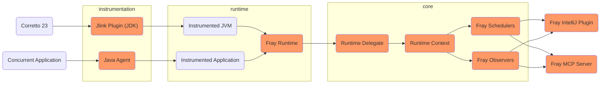

```mermaid
graph LR
    classDef frayComponent fill:#f96
    app("Concurrent Application")
    jvm("Corretto 23")
    subgraph instrumentation
        jlink("`Jlink Plugin (JDK)`"):::frayComponent
        click jlink "https://github.com/cmu-pasta/fray/tree/main/instrumentation/jdk"
        agent("`Java Agent`"):::frayComponent
        click agent "https://github.com/cmu-pasta/fray/tree/main/instrumentation/agent"
    end
    jvm --> jlink
    app --> agent
    subgraph runtime
        instrumented_app("Instrumented Application")
        instrumented_jvm("Instrumented JVM")
        fray_runtime("Fray Runtime"):::frayComponent
    end
    agent --> instrumented_app
    jlink --> instrumented_jvm
    instrumented_jvm --> fray_runtime
    instrumented_app --> fray_runtime
    subgraph core 
        fray_runtime_delegate("Runtime Delegate"):::frayComponent
        click fray_runtime_delegate "https://github.com/cmu-pasta/fray/tree/main/core/src/main/kotlin/org/pastalab/fray/core/delegates"
        fray_runtime_context("Runtime Context"):::frayComponent
        click fray_runtime_context "https://github.com/cmu-pasta/fray/blob/main/core/src/main/kotlin/org/pastalab/fray/core/RunContext.kt"
        fray_schedulers("Fray Schedulers"):::frayComponent
        click fray_schedulers "https://github.com/cmu-pasta/fray/tree/main/core/src/main/kotlin/org/pastalab/fray/core/scheduler"
        fray_observers("Fray Observers"):::frayComponent
        click fray_observers "https://github.com/cmu-pasta/fray/tree/main/core/src/main/kotlin/org/pastalab/fray/core/observers"
        fray_runtime_delegate --> fray_runtime_context
        fray_runtime_context --> fray_schedulers
        fray_runtime_context --> fray_observers
    end
    fray_runtime --> fray_runtime_delegate

    fray_intellij_plugin("Fray IntelliJ Plugin"):::frayComponent
    click fray_intellij_plugin "https://github.com/cmu-pasta/fray/tree/main/plugins/idea"
    fray_mcp_server("Fray MCP Server"):::frayComponent
    click fray_mcp_server "https://github.com/cmu-pasta/fray/tree/main/mcp"
    fray_schedulers --> fray_intellij_plugin
    fray_schedulers --> fray_mcp_server
    fray_observers --> fray_intellij_plugin
    fray_observers --> fray_mcp_server
```
